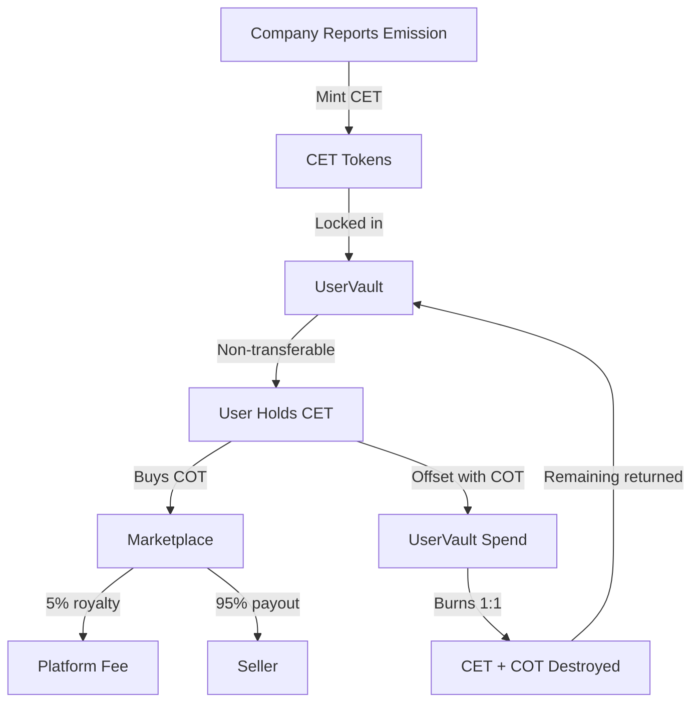
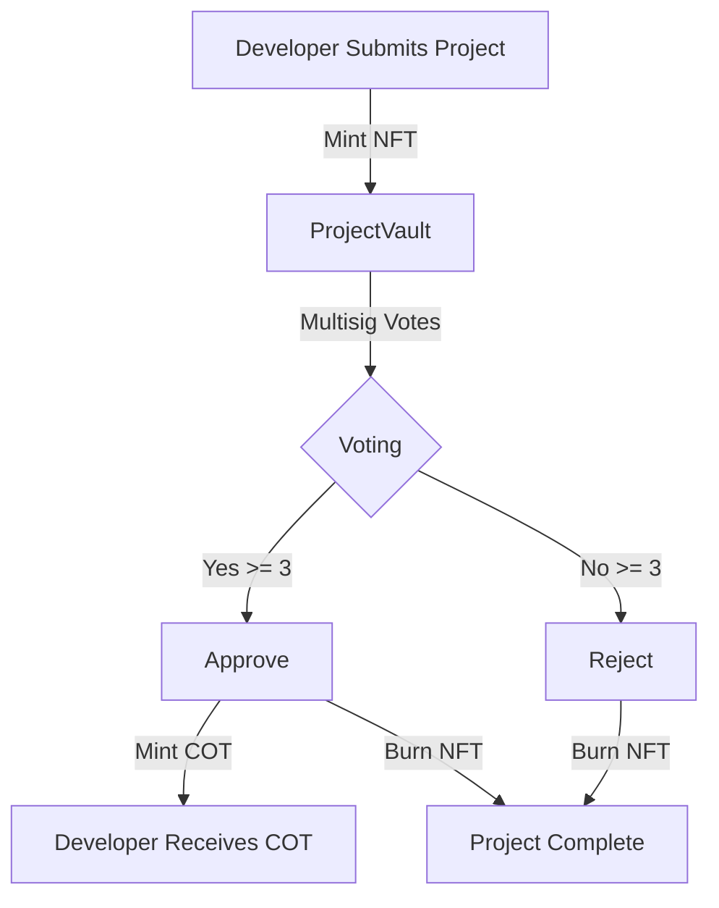
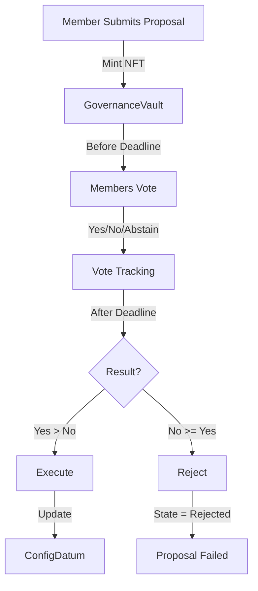

# Carbonica - Carbon Emission Tracking Platform

A comprehensive Plutus V3 smart contract system for tracking, verifying, and offsetting carbon emissions on Cardano.

## 🌍 System Overview

Carbonica is a decentralized carbon credit platform that enables:
- **Emission Reporting**: Companies report carbon emissions and receive CET (Carbon Emission Tokens)
- **Project Verification**: Offset projects are validated through DAO voting
- **Carbon Offsetting**: CET holders can burn tokens by purchasing COT (Carbon Offset Tokens)
- **Marketplace Trading**: Users can trade COT tokens with platform royalties
- **DAO Governance**: Multisig-based governance for platform configuration

---

## 📋 Smart Contract Architecture

### Core Validators

#### 1. **CET Policy** (`CetPolicy.hs`)
**Purpose**: Minting policy for Carbon Emission Tokens

**Actions**:
- **Mint CET** (`CetMintWithDatum`):
  - Requires: Emission data (company, quantity, category)
  - Output: CET tokens sent to UserVault with user's stake credential
  - Validates: Correct quantity, script address, datum match

- **Burn CET** (`CetBurnWithCot`):
  - Requires: Equal amount of COT tokens being burned (1:1 ratio)
  - Validates: Both CET and COT quantities negative and equal

**Key Rules**:
```
Mint: CET qty > 0, sent to script with datum
Burn: CET qty < 0, CET qty == COT qty (offset ratio)
```

---

#### 2. **COT Policy** (`CotPolicy.hs`)
**Purpose**: Minting policy for Carbon Offset Tokens

**Actions**:
- **Mint COT** (`action = 0`):
  - Requires: Valid ProjectDatum input, vault tokens burned, multisig approval
  - Output: COT tokens for approved offset projects
  - Validates: Project exists, multisig signatures, vault burning

- **Burn COT** (`action = 1`):
  - Used during emission offsetting (paired with CET burning)
  - Validates: CET and COT burned in 1:1 ratio OR multisig approval

**Key Rules**:
```
Mint: Project approved, vault burned, 3/5 multisig
Burn: COT qty < 0, paired with CET OR multisig override
```

---

#### 3. **UserVault** (`UserVault.hs`)
**Purpose**: Spending validator that locks user's CET tokens

**Actions**:
- **Offset Emissions** (`VaultOffset`):
  - Requires: CET and COT tokens with matching quantities
  - Burns both tokens in 1:1 ratio
  - Returns any remaining tokens to same vault address
  - Validates: Negative quantities, exact ratio, proper return address

**Key Rules**:
```
Offset: CET qty < 0, CET qty == COT qty
Remaining tokens returned to user's script address with stake key
```

**Workflow**:
1. User's CET is locked in vault (non-transferable)
2. User purchases COT from marketplace
3. User spends vault with VaultOffset redeemer
4. Both CET and COT burned simultaneously
5. Remaining tokens returned to vault

---

#### 4. **Marketplace** (`Marketplace.hs`)
**Purpose**: Spending validator for trading COT tokens

**Datum**:
```haskell
MarketplaceDatum
  { mdOwner  :: Wallet       -- Seller's address
  , mdAmount :: Integer      -- Price in lovelace
  }
```

**Actions**:
- **Buy** (`MktBuy`):
  - Royalty: 5% platform fee
  - Seller receives: 95% of sale price
  - Platform receives: 5% royalty
  - Validates: Correct payment distribution

- **Withdraw** (`MktWithdraw`):
  - Owner cancels listing
  - Requires: Owner's signature

**Key Rules**:
```
Buy:
  - Seller gets (price * 95/100) lovelace
  - Platform gets (price * 5/100) lovelace

Withdraw:
  - Owner must sign
```

---

#### 5. **DAO Governance** (`DaoGovernance.hs`)
**Purpose**: Dual validator (minting + spending) for platform governance

**Minting Policy** (Proposal NFT lifecycle):
- **Submit Proposal** (`DaoSubmitProposal`):
  - Mints unique proposal NFT
  - Creates GovernanceDatum with vote tracking
  - Initial state: InProgress

- **Burn Proposal** (`DaoBurnProposal`):
  - Burns proposal NFT after final state

**Spending Validator** (Proposal voting):
- **Vote** (`DaoVote`):
  - Requires: Before deadline, voter in multisig, not voted yet
  - Updates: Vote count, voter status
  - State remains: InProgress

- **Execute** (`DaoExecute`):
  - Requires: After deadline, yes > no
  - Updates: ConfigDatum per proposal action
  - State changes: InProgress → Executed

- **Reject** (`DaoReject`):
  - Requires: After deadline, no >= yes
  - State changes: InProgress → Rejected

**Proposal Actions** (updates to ConfigDatum):
```
- ActionAddSigner / ActionRemoveSigner
- ActionUpdateFeeAmount / ActionUpdateFeeAddress
- ActionAddCategory / ActionRemoveCategory
- ActionUpdateRequired (multisig threshold)
- ActionUpdateProposalDuration
- ActionUpdateScriptHash (upgrade validators)
```

**Key Rules**:
```
Vote: Before deadline, voter in multisig, Pending → Voted
Execute: After deadline, yes > no, updates ConfigDatum
Reject: After deadline, no >= yes
Multisig: 5 members, 3 required for any action
```

---

#### 6. **ProjectVault** (`ProjectVault.hs`)
**Purpose**: Spending validator for project verification and COT minting

**Actions**:
- **Vote** (`VaultVote`):
  - Requires: Voter in multisig, not voted yet, project submitted
  - Updates: Vote count (yes/no), voter list
  - Project continues in vault

- **Approve** (`VaultApprove`):
  - Requires: Quorum reached (3+ yes votes), multisig signatures
  - Mints: COT tokens to developer's address
  - Burns: Project NFT

- **Reject** (`VaultReject`):
  - Requires: Quorum reached (3+ no votes), multisig signatures
  - Burns: Project NFT (no COT minted)

**Key Rules**:
```
Vote: Voter in multisig, not already voted, project in Submitted state
Approve: yes_votes >= 3, developer gets COT, project NFT burned
Reject: no_votes >= 3, project NFT burned
```

---
## 🔄 Complete System Workflow

### Workflow 1: Emission Reporting & Offsetting



**Steps**:
1. **Report Emission** (Off-chain → CET Policy)
   - Company submits emission data
   - CET Policy mints tokens with EmissionDatum
   - Tokens sent to UserVault with company's stake key

2. **Acquire COT** (Marketplace)
   - User finds COT listing
   - Pays lovelace (100 lovelace = price)
   - 95 lovelace to seller, 5 lovelace to platform
   - COT transferred to user

3. **Offset Emission** (UserVault)
   - User spends vault with VaultOffset
   - Provides equal CET and COT quantities
   - Both tokens burned in transaction
   - Remaining tokens returned to vault

---

### Workflow 2: Carbon Offset Project Verification



**Steps**:
1. **Submit Project** (Off-chain → Project Policy)
   - Developer submits project proposal
   - Project NFT minted with ProjectDatum
   - Sent to ProjectVault for voting

2. **Multisig Voting** (ProjectVault)
   - 5 validators vote (yes/no)
   - Each validator can vote once
   - Vote counts tracked in ProjectDatum

3. **Approve/Reject** (ProjectVault + COT Policy)
   - If yes >= 3: COT minted to developer, NFT burned
   - If no >= 3: NFT burned, no COT minted

---

### Workflow 3: DAO Governance



**Steps**:
1. **Submit Proposal** (DAO Governance - Mint)
   - Multisig member creates proposal
   - Proposal NFT minted
   - GovernanceDatum includes action (e.g., add signer)

2. **Voting Period** (DAO Governance - Spend)
   - Members vote before deadline
   - Each voter: Pending → Voted
   - Vote counts updated (yes/no/abstain)

3. **Execute/Reject** (After deadline)
   - If yes > no: Execute action, update ConfigDatum
   - If no >= yes: Mark as rejected
   - Proposal NFT burned

---

## 🔧 Configuration System

### ConfigDatum (Platform State)
```haskell
ConfigDatum
  { cdMultisig          :: Multisig       -- 5 members, 3 required
  , cdFeesAmount        :: Integer        -- Platform fee (lovelace)
  , cdFeesAddress       :: PubKeyHash     -- Royalty recipient
  , cdProposalDuration  :: POSIXTime      -- Voting period (e.g., 7 days)
  , cdCategories        :: [ByteString]   -- Valid emission categories
  , cdProjectPolicyId   :: ByteString     -- Project NFT policy
  , cdProjectVaultHash  :: ByteString     -- Project vault script
  , cdVotingHash        :: ByteString     -- DAO governance script
  , cdCotPolicyId       :: ByteString     -- COT policy
  , cdCetPolicyId       :: ByteString     -- CET policy
  , cdUserVaultHash     :: ByteString     -- User vault script
  }
```

**Stored**: On-chain in UTXO with Identification NFT
**Updated**: Through DAO governance proposals only
**Used by**: All validators for configuration lookup (via reference input)

---

## 🛡️ Security Features

### Multisig Protection
- 5 authorized validators
- 3 signatures required for:
  - COT minting
  - Project approval/rejection
  - Governance execution

### Token Locking
- CET tokens locked in UserVault (non-transferable)
- Can only exit through burning (1:1 with COT)

### Datum Validation
- All datums verified against redeemer data
- Exact quantity matching (mint vs datum)
- State transitions validated (InProgress → Executed/Rejected)

### Economic Security
- 5% marketplace royalty prevents spam
- Quorum requirements prevent single-actor control
- Deadline enforcement prevents indefinite proposals

---

## 🚨 Security Audit Status

**Status**: ⚠️ **NOT PRODUCTION READY**

### Critical Issues Identified

1. **COT Minting Verification** (CotPolicy.hs:175)
   - Missing: Positive quantity check for COT minting
   - Risk: Invalid mint operations possible

2. **Marketplace Asset Transfer** (Marketplace.hs:200)
   - Missing: COT token transfer validation
   - Risk: Only lovelace payment verified, not COT delivery

3. **UserVault Token Return** (UserVault.hs:186)
   - Issue: Uses `>=` instead of `==` for remaining tokens
   - Risk: Token manipulation possible

4. **CET Script Address** (CetPolicy.hs:130)
   - Missing: Stake credential verification
   - Risk: CET could be locked in wrong script

### Recommendations
- [ ] Fix all identified issues
- [ ] Professional audit by 2+ firms (Tweag, MLabs, etc.)
- [ ] Comprehensive property-based testing
- [ ] Testnet deployment with bug bounty
- [ ] Formal verification of critical paths

---

## 📦 Project Structure

```
├── src/
│   ├── Carbonica/
│   │   ├── Validators/
│   │   │   ├── CetPolicy.hs           # CET minting/burning
│   │   │   ├── CotPolicy.hs           # COT minting/burning
│   │   │   ├── UserVault.hs           # CET locking/offsetting
│   │   │   ├── Marketplace.hs         # COT trading
│   │   │   ├── DaoGovernance.hs       # Platform governance
│   │   │   ├── ProjectVault.hs        # Project verification
│   │   │   └── Common.hs              # Shared helpers
│   │   └── Types/
│   │       ├── Core.hs                # Base types
│   │       ├── Config.hs              # Platform config
│   │       ├── Emission.hs            # CET types
│   │       ├── Project.hs             # Project types
│   │       └── Governance.hs          # DAO types
├── test/
│   └── Test/Carbonica/
│       ├── Unit/                      # Unit tests (24 tests)
│       └── Properties/                # QuickCheck tests (9 properties)
├── app/
│   └── GenBlueprint.hs                # Blueprint generator
├── blueprints/                        # Generated artifacts
├── PLINTH_IMPROVEMENTS.md             # Implementation roadmap
└── Makefile                           # Build commands
```

---

## 🚀 Quick Start

### Prerequisites

1. **Install Nix** (multi-user):
   ```bash
   sh <(curl -L https://nixos.org/nix/install) --daemon
   ```

2. **Enable Flakes** (`/etc/nix/nix.conf`):
   ```
   experimental-features = nix-command flakes
   trusted-users = yourusername root
   extra-substituters = https://cache.iog.io
   extra-trusted-public-keys = hydra.iohk.io:f/Ea+s+dFdN+3Y/G+FDgSq+a5NEWhJGzdjvKNGv0/EQ=
   ```

3. **Restart Nix Daemon**:
   ```bash
   sudo systemctl restart nix-daemon.service
   ```

### Build & Test

```bash
# Enter development shell
nix develop

# Build all validators
make build

# Run tests (33 tests: 24 unit + 9 property tests)
make test

# Generate blueprint
make blueprint

# Check script sizes
cabal run gen-blueprint | jq '.validators[] | {name: .title, size: .compiledCode | length}'
```

---

## 🧪 Testing

### Test Coverage

**Unit Tests** (24 tests):
- Emission data validation
- Multisig verification
- Smart constructor bounds
- Datum parsing

**Property Tests** (9 properties × 100 cases = 900 tests):
- Token arithmetic (lovelace, COT amounts)
- Royalty calculations
- Datum invariants
- List safety properties

**Run Tests**:
```bash
make test
# or
cabal test --test-show-details=streaming
```

---

## 📘 Development Guide

### Adding New Validators

1. Create validator file: `src/Carbonica/Validators/NewValidator.hs`
2. Add to `smartcontracts.cabal` exposed-modules
3. Update `app/GenBlueprint.hs` to include validator
4. Add tests in `test/Test/Carbonica/Unit/` or `test/Test/Carbonica/Properties/`
5. Run `make build && make test`

### Modifying Types

1. Update type definition in `src/Carbonica/Types/`
2. Ensure `makeIsDataSchemaIndexed` or `unstableMakeIsData` present
3. Update all validators using the type
4. Run `make test` to verify changes
5. Update blueprint with `make blueprint`

---

## 🎯 Deployment Checklist

- [ ] Fix all critical security issues
- [ ] Complete professional audit
- [ ] 100% test coverage on critical paths
- [ ] Deploy to preprod testnet
- [ ] Run 30-day bug bounty
- [ ] Update ConfigDatum with real multisig keys
- [ ] Generate production blueprints
- [ ] Document off-chain integration points
- [ ] Prepare emergency shutdown procedures

---

## 📚 Technical Documentation

### Phase Implementations

✅ **Phase 1**: Type Safety & Smart Constructors
✅ **Phase 2**: Comprehensive Error Handling
✅ **Phase 3**: Testing Infrastructure (QuickCheck)
✅ **Phase 4**: Code Refactoring (DRY, Common module)
✅ **Phase 5**: Advanced Features (Scott Encoding, Haddock)

See `PLINTH_IMPROVEMENTS.md` for detailed implementation notes.

### Performance Optimizations

- **Scott Encoding**: 20-30% smaller scripts (Plutus 1.1+)
- **INLINEABLE Pragmas**: Cross-module optimization
- **Hoisted Extractions**: Common values extracted once per transaction
- **Error Codes**: 6-character codes minimize on-chain footprint

---

## 🤝 Contributing

This is a carbon tracking platform. Contributions should focus on:
- Security improvements
- Gas optimization
- Test coverage expansion
- Documentation enhancements

**Do not**:
- Add features without security review
- Modify core validation logic without tests
- Remove error handling or validation

---

## 📄 License

Apache-2.0

---

## ⚠️ Disclaimer

**THIS SOFTWARE IS PROVIDED FOR EDUCATIONAL PURPOSES ONLY.**

These smart contracts have NOT been professionally audited and contain known security issues. Do NOT deploy to mainnet without:
1. Fixing all identified vulnerabilities
2. Professional audit by multiple firms
3. Comprehensive testing on testnets
4. Legal review of carbon credit compliance

**USE AT YOUR OWN RISK.**
